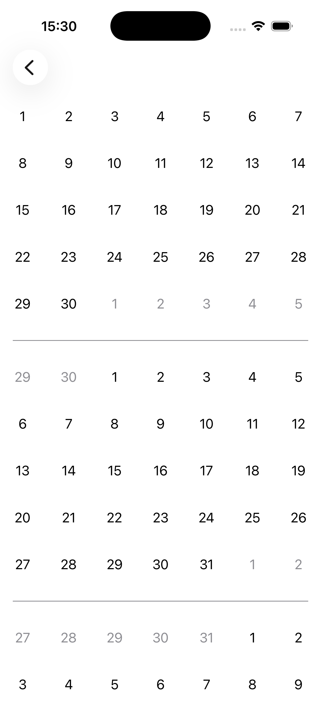
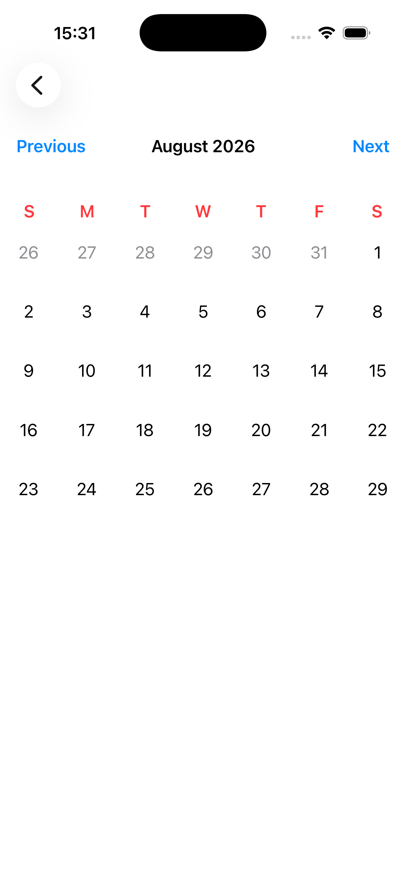
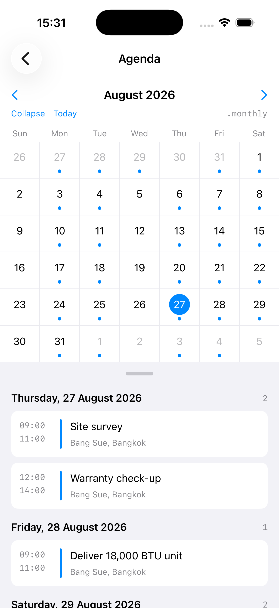
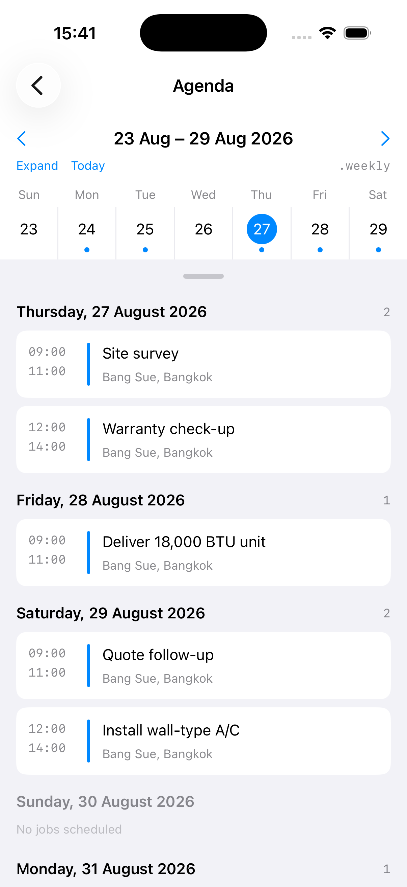
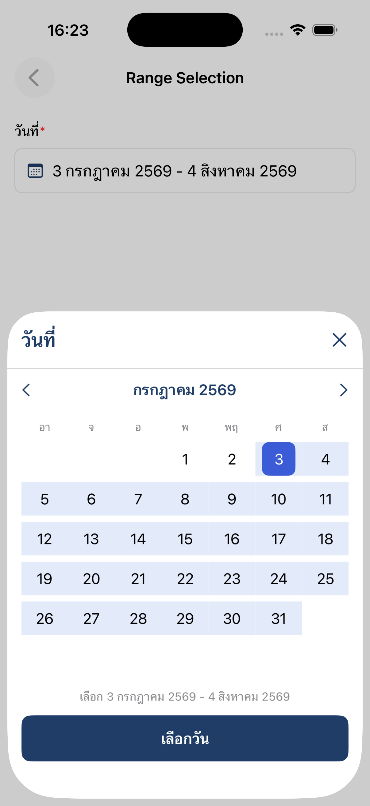

# 📅 EZCalendar

**EZCalendar** is a lightweight, logic-first calendar library for **SwiftUI**. It does the date math — month grids, leading/trailing padding days, horizontal month paging — and hands you `CalendarDay` values. You render every pixel yourself with `@ViewBuilder` closures.

There are no built-in colors, fonts, or cell designs. That is the point.

<table>
  <tr>
    <td align="center" width="25%">
      
    </td>
    <td align="center" width="25%">
      
    </td>
    <td align="center" width="25%">
      
    </td>
    <td align="center" width="25%">
      
    </td>
  </tr>
  <tr>
    <td align="center"><code>EZCalendarItemView</code></td>
    <td align="center"><code>EZCalendarHorizontalPagingView</code></td>
    <td align="center" colspan="2"><code>EZCalendarAgendaView</code></td>
  </tr>
  <tr>
    <td align="center"><sub>One month as a grid</sub></td>
    <td align="center"><sub>Swipe between months</sub></td>
    <td align="center"><sub><code>.monthly</code></sub></td>
    <td align="center"><sub><code>.weekly</code></sub></td>
  </tr>
</table>

The last two are the same day, before and after the collapse: drag the handle and the month closes onto its selected week, handing the freed height to the list.

> Every pixel above comes from the Demo app's own `@ViewBuilder` closures — the red weekday letters, the event dots, the card styling. The library supplied only the dates and the layout.

---

## ⚙️ Requirements

| | |
| --- | --- |
| Platforms | **iOS 17.0+**, **macOS 15.0+** |
| Swift tools | **6.0** (package builds in Swift 6 language mode) |
| Xcode | **16.0+** |

---

## 📦 Installation

### Swift Package Manager

In Xcode: **File → Add Package Dependencies…** and enter:

```
https://github.com/q-chang/ezcalendar-ios
```

Or in `Package.swift`:

```swift
dependencies: [
    .package(url: "https://github.com/q-chang/ezcalendar-ios", from: "2.0.0")
]
```

Then add `EZCalendar` to your target:

```swift
.target(name: "MyApp", dependencies: [
    .product(name: "EZCalendar", package: "ezcalendar-ios")
])
```

---

## 🏗️ Architecture

```
CalendarMonth (month + year + events)   ← you build these
        │
        ▼
EZCalendarItemViewModel  (internal)     ← expands a month into 7-column weeks,
        │                                  filling padding days from adjacent months
        ▼
[CalendarWeek] → [CalendarDay]
        │
        ▼
EZCalendarItemView                      ← LazyVGrid, one month
        │
        ▼
EZCalendarHorizontalPagingView          ← swipeable strip of months + weekday header
EZCalendarAgendaView                    ← collapsible calendar + synced event list
```

The grid logic is deliberately separated from rendering, so `EZCalendarItemView` composes into a vertical `ScrollView`, a `TabView`, or anything else just as easily as into the built-in pager.

---

## 🚀 Quick Start

### A single month

```swift
import SwiftUI
import EZCalendar

struct MonthView: View {
    var body: some View {
        GeometryReader { proxy in
            EZCalendarItemView(
                CalendarMonth(month: 9, year: 2026),
                calendar: .init(identifier: .gregorian)
            ) { calendarDay in
                Text("\(calendarDay.date.map { Calendar.current.component(.day, from: $0) } ?? 0)")
                    .foregroundStyle(calendarDay.isCurrentMonth ? .primary : .secondary)
                    .frame(
                        width: proxy.size.width / 7,
                        height: proxy.size.width / 7
                    )
            }
        }
    }
}
```

### A swipeable, paging calendar

```swift
import SwiftUI
import EZCalendar

final class CalendarViewModel: ObservableObject {
    let calendar: Calendar
    @Published var currentMonth: Date
    @Published var calendarMonths: [CalendarMonth]

    init(calendar: Calendar = .init(identifier: .gregorian)) {
        let today = Date()
        let year = calendar.component(.year, from: today)

        var start = DateComponents(); start.year = year;     start.month = 1;  start.day = 1
        var end   = DateComponents(); end.year   = year + 5; end.month   = 12; end.day   = 1

        self.calendar = calendar
        self.currentMonth = calendar.startOfDay(for: today)
        self.calendarMonths = EZCalendarHelper.generateCalendarMonths(
            startDate: calendar.date(from: start)!,
            endDate: calendar.date(from: end)!,
            calendar: calendar
        )
    }
}

struct PagingCalendarView: View {
    @StateObject private var viewModel = CalendarViewModel()

    var body: some View {
        GeometryReader { proxy in
            EZCalendarHorizontalPagingView(
                withCalendar: viewModel.calendar,
                currentMonth: $viewModel.currentMonth,
                calendarMonths: $viewModel.calendarMonths
            ) { weekdayTitle in
                Text(weekdayTitle)
                    .bold()
                    .frame(width: proxy.size.width / 7, height: 24)
            } dayItemViewContent: { calendarDay in
                let day = calendarDay.date.map { viewModel.calendar.component(.day, from: $0) } ?? 0

                Text("\(day)")
                    .foregroundStyle(calendarDay.isCurrentMonth ? .primary : .secondary)
                    .padding(4)
                    .background(calendarDay.hasEvents ? Color.blue.opacity(0.25) : .clear)
                    .clipShape(Circle())
                    .frame(
                        width: proxy.size.width / 7,
                        height: proxy.size.width / 7
                    )
            }
            .weekdayScrollable(true)
            .gridLineColor(.secondary.opacity(0.15))
        }
    }
}
```

---

## 📚 API Reference

### Models

#### `CalendarMonth`

The unit of data you supply. One month, identified by integers — **not** a `Date`.

```swift
public init(month: Int, year: Int, events: [CalendarEvent] = [])
```

> ⚠️ `month` and `year` are interpreted in the era of the `Calendar` you pass to the view. With `Calendar(identifier: .buddhist)`, January 2026 CE is `CalendarMonth(month: 1, year: 2569)`.

`hashString` is the identity used by the pager's scroll position. It is derived from `hashValue`, so it **changes whenever `events` changes** — see [Known limitations](#-known-limitations).

#### `CalendarDay`

What your `dayItemViewContent` closure receives. Read-only; you never construct one.

| Property | Type | Meaning |
| --- | --- | --- |
| `date` | `Date?` | Midnight on that day. `nil` only if date math failed. |
| `isCurrentMonth` | `Bool` | `false` for padding days borrowed from the previous/next month. |
| `hasEvents` | `Bool` | `true` if the month's `events` contain an exact date match. |

There is no `dayNumber` — derive it with `Calendar.component(.day, from:)`.

#### `CalendarEvent`

```swift
public init(uuid: String = UUID().uuidString, eventDate: Date)
```

#### `CalendarWeek`

```swift
public init(calendarDays: [CalendarDay])
```

A row of exactly 7 days. Produced internally; rarely constructed by callers.

---

### `EZCalendarHelper.generateCalendarMonths`

Builds a contiguous `[CalendarMonth]` spanning a date range.

```swift
public static func generateCalendarMonths(
    startDate: Date,
    endDate: Date,
    calendar: Calendar = .current,
    events: [CalendarEvent] = []
) -> [CalendarMonth]
```

| Parameter | Default | Description |
| --- | --- | --- |
| `startDate` | required | Range start; normalized to the first of its month. |
| `endDate` | required | Range end, inclusive of that month. |
| `calendar` | `.current` | Calendar system used to extract month/year components. |
| `events` | `[]` | **Currently ignored** — see [Known limitations](#-known-limitations). |

---

### `EZCalendarItemView`

One month as a 7-column `LazyVGrid`.

<p align="center">
  
  <br>
  <sub>Three of them stacked in a <code>ScrollView</code>. Cells are unstyled <code>Text</code>; padding days are dimmed by the caller reading <code>isCurrentMonth</code>.</sub>
</p>

```swift
public init(
    _ calendarMonth: CalendarMonth,
    calendar: Calendar,
    @ViewBuilder dayItemViewContent: @escaping (CalendarDay) -> DayItemView
)
```

Rows are 5 or 6 depending on the month; every row always has 7 cells. Grid spacing is a fixed `1pt`, which is what lets a background color read as grid lines.

> ⚠️ The `.gridLineColor(_:)` modifier on `EZCalendarItemView` is **internal** and cannot be called from another module. Draw your own separators in the cell, or use the pager's public modifier.

---

### `EZCalendarHorizontalPagingView`

A horizontally paged strip of months, snapped with `.scrollTargetBehavior(.viewAligned)`.

<p align="center">
  
  <br>
  <sub>The weekday header scrolls with each page here (<code>.weekdayScrollable(true)</code>). Previous/Next drive the <code>currentMonth</code> binding.</sub>
</p>

```swift
public init(
    withCalendar calendar: Calendar,
    weekDayTitles: [String]? = nil,
    currentMonth: Binding<Date>,
    calendarMonths: Binding<[CalendarMonth]>,
    @ViewBuilder weekdayItemViewContent: @escaping (String) -> WeekdayItemView,
    @ViewBuilder dayItemViewContent: @escaping (CalendarDay) -> DayItemView
)
```

| Parameter | Description |
| --- | --- |
| `withCalendar` | Calendar used for all date math. Its `locale` also drives weekday names. |
| `weekDayTitles` | Optional custom header titles. Defaults to `DateFormatter.shortWeekdaySymbols` for the calendar's locale. |
| `currentMonth` | Two-way binding. Swiping writes to it; writing to it animates a scroll. |
| `calendarMonths` | Binding to the data source. Mutate an element to inject events for that month. |

#### Modifiers

| Modifier | Default | Effect |
| --- | --- | --- |
| `.gridLineColor(_ color: Color?)` | `nil` | Sets a 1pt background behind the grid so gaps read as separators. `nil` is a no-op. |
| `.weekdayScrollable(_ flag: Bool)` | `false` | `false` pins one header above the pager; `true` gives every month its own header that scrolls with it. |

---

### `EZCalendarAgendaView`

A collapsible calendar stacked on a continuous, date-grouped event list, kept in sync in both directions.

<table>
  <tr>
    <td align="center" width="50%">
      
    </td>
    <td align="center" width="50%">
      
    </td>
  </tr>
  <tr>
    <td align="center"><code>.monthly</code></td>
    <td align="center"><code>.weekly</code></td>
  </tr>
</table>

<sub>The same selected day (27 August) either side of the collapse — only the calendar's height changes, and the list keeps its position. Dots mark days with events, including the dimmed adjacent-month days. The pill under the grid is the drag handle.</sub>

The slots, and who fills them:

```
┌─────────────────────────────┐
│  ‹   July 2569   ›          │  titleViewContent
│  Su Mo Tu We Th Fr Sa       │  weekdayItemViewContent
│  30  1  2 [3] 4  5  6       │  dayItemViewContent
│   7  8  9 10 11 12 13       │  … collapses to a single week
├─────────────────────────────┤
│            ▭                │  handleViewContent
│  Wednesday, 3 July 2569     │  listHeaderViewContent  (sticky)
│    09:00  Install job       │  eventItemViewContent
└─────────────────────────────┘
```

```swift
@State private var mode: EZCalendarAgendaMode = .monthly
@State private var selectedDate = Date()
@State private var months: [CalendarMonth] = []

EZCalendarAgendaView(
    withCalendar: calendar,
    mode: $mode,
    selectedDate: $selectedDate,
    calendarMonths: $months,
    events: jobs,                     // your own Identifiable type
    eventDate: { $0.scheduledAt },    // which day each event belongs to
    weekdayItemViewContent: { Text($0).frame(maxWidth: .infinity) },
    dayItemViewContent: { context in
        DayCell(context)              // .isSelected, .isToday, .hasEvents
    },
    listHeaderViewContent: { section in
        Text(headerFormatter.string(from: section.date))
    },
    eventItemViewContent: { job in
        JobRow(job)
    }
)
.gridLineColor(.secondary.opacity(0.1))
```

The longer initializer adds `titleViewContent`, `emptyDayViewContent` and `handleViewContent`.

**Behavior**

| Interaction | Result |
| --- | --- |
| Tap a day | The list scrolls that day's sticky header to the top. In `.monthly` the tap also snaps the calendar to `.weekly`. |
| Scroll the list | Whichever sticky header is pinned at the top becomes the selected day; the calendar pages itself to follow. |
| Drag the grab handle | The calendar tracks the finger, non-selected weeks fading as the grid closes. On release it commits if the drag passed `collapseThreshold` **or** was flicked faster than `collapseVelocityThreshold`, and springs back otherwise. |
| Scroll the event list | Scrolls the list. It never changes the mode, in either direction, over-scroll included. |
| Swipe the calendar in `.monthly` | Selects the 1st of the new month — or today, if today falls in it. |
| Swipe the calendar in `.weekly` | Selects the week's first day — or today, if today falls in that week. |

Page it programmatically with `EZCalendarAgendaPaging.selection(paging:from:mode:calendarMonths:calendar:)`, or from your own title bar with the `pageForward()` / `pageBackward()` closures on `EZCalendarAgendaTitleContext`.

**Modifiers**

| Modifier | Default | Effect |
| --- | --- | --- |
| `.gridLineColor(_:)` | `nil` | Colour showing through the grid's 1pt gaps. |
| `.collapseThreshold(_:)` | `78` | How far the grab handle must be dragged, on release, to commit a switch. |
| `.collapseVelocityThreshold(_:)` | `350` | How fast it must be flicked (points/second) to commit regardless of distance. `0` disables the flick. |
| `.collapseAnimation(_:)` | `.easeOut(duration: 0.3)` | How a released gesture settles. |

> **Use `context.hasEvents`, not `context.day.hasEvents`.** The agenda buckets your events by *day*, so its flag works for events stamped at a real time and for padding days — neither of which `CalendarDay.hasEvents` handles. See limitation 2 below.

> `selectedDate` is normalised to the start of its day in the view's calendar. Events outside `calendarMonths` still appear in the list, which spans the months unioned with your event dates.

---

## 🌍 Localization & calendar systems

Everything flows from the `Calendar` you pass in — including weekday names, which are read from `calendar.locale`:

```swift
var calendar = Calendar(identifier: .buddhist)
calendar.locale = Locale(identifier: "th_TH")

EZCalendarHorizontalPagingView(withCalendar: calendar, ...)
```

To override the header titles entirely, pass `weekDayTitles`:

```swift
EZCalendarHorizontalPagingView(
    withCalendar: calendar,
    weekDayTitles: calendar.veryShortWeekdaySymbols,   // ["S","M","T","W","T","F","S"]
    ...
)
```

> ⚠️ Titles are rendered with `ForEach(id: \.self)`. `veryShortWeekdaySymbols` contains duplicates in many locales (two `"S"`, two `"T"` in English), which gives SwiftUI colliding view identities. Prefer `shortWeekdaySymbols`, or disambiguate your own titles.

---

## 🗓️ Events

Events live on the month, not on the day. Attach them by replacing the `CalendarMonth`:

```swift
func loadEvents(for monthDate: Date) {
    let month = calendar.component(.month, from: monthDate)
    let year  = calendar.component(.year,  from: monthDate)

    guard let index = calendarMonths.firstIndex(where: {
        $0.month == month && $0.year == year
    }) else { return }

    calendarMonths[index] = CalendarMonth(
        month: month,
        year: year,
        events: fetchEvents(month: month, year: year)
    )
}
```

Drive it from the paging view's binding:

```swift
.onChange(of: viewModel.currentMonth) { _, monthDate in
    viewModel.loadEvents(for: monthDate)
}
```

**Matching is exact `Date` equality.** `CalendarDay.date` is midnight in the calendar's time zone, so an event stamped `14:30` will never match. Normalize event dates before attaching them:

```swift
CalendarEvent(eventDate: calendar.startOfDay(for: rawDate))
```

---

## 🎯 Date selection

`EZCalendarItemView` and `EZCalendarHorizontalPagingView` keep no selection state. Keep the selected date (or range) in your own state, make the day cell a `Button`, and draw the mark inside `dayItemViewContent`. (`EZCalendarAgendaView` is different: it has its own `selectedDate` binding.)

### Single date

```swift
@State private var selectedDate: Date?

EZCalendarHorizontalPagingView(
    withCalendar: calendar,
    currentMonth: $currentMonth,
    calendarMonths: $calendarMonths
) { weekdayTitle in
    Text(weekdayTitle).frame(maxWidth: .infinity)
} dayItemViewContent: { calendarDay in
    if calendarDay.isCurrentMonth, let date = calendarDay.date {
        let isSelected = selectedDate.map { calendar.isDate($0, inSameDayAs: date) } ?? false

        Button {
            selectedDate = date
        } label: {
            Text("\(calendar.component(.day, from: date))")
                .frame(maxWidth: .infinity, minHeight: 44)
                .overlay {
                    if isSelected {
                        Circle().stroke(.red, lineWidth: 2)
                    }
                }
                .contentShape(Rectangle())
        }
        .buttonStyle(.plain)
    } else {
        Color.clear.frame(height: 44)   // padding day
    }
}
```

### Range (Start Date → End Date)

<p align="center">
  
  <br>
  <sub>The Demo's <b>Range Selection</b> screen: 3 July → 4 August 2569, crossing a page.</sub>
</p>

| Current state | Tapped day | Result |
| --- | --- | --- |
| nothing selected | any | Start = day |
| Start only | after Start | End = day |
| Start only | same day as Start | End = Start — a one-day range |
| Start only | before Start | Start = day, End stays empty |
| Start + End | any | Start = day, End cleared — a new range begins |

```swift
struct DateRangeSelection {
    var startDate: Date?
    var endDate: Date?

    mutating func select(_ date: Date, calendar: Calendar) {
        let day = calendar.startOfDay(for: date)

        // Nothing selected yet, or a finished range: this tap starts a new one.
        guard let startDate, endDate == nil else {
            self.startDate = day
            self.endDate = nil
            return
        }

        if day < startDate {
            self.startDate = day   // before Start: it becomes the new Start
        } else {
            self.endDate = day     // on or after Start
        }
    }

    func isEndpoint(_ date: Date, calendar: Calendar) -> Bool {
        [startDate, endDate].contains { endpoint in
            endpoint.map { calendar.isDate($0, inSameDayAs: date) } ?? false
        }
    }

    /// A one-day range has no band.
    func isInRange(_ date: Date, calendar: Calendar) -> Bool {
        guard let startDate, let endDate,
              !calendar.isDate(startDate, inSameDayAs: endDate) else { return false }
        let day = calendar.startOfDay(for: date)
        return day >= startDate && day <= endDate
    }
}
```

The day cell draws a band for days in the range and a filled square for Start and End:

```swift
@State private var range = DateRangeSelection()

// dayItemViewContent:
if calendarDay.isCurrentMonth, let date = calendarDay.date {
    let isEndpoint = range.isEndpoint(date, calendar: calendar)
    let isInRange = range.isInRange(date, calendar: calendar)

    Button {
        range.select(date, calendar: calendar)
    } label: {
        Text("\(calendar.component(.day, from: date))")
            .foregroundStyle(isEndpoint ? .white : .primary)
            .frame(maxWidth: .infinity, minHeight: 44)
            .background {
                ZStack {
                    if isInRange {
                        Color.blue.opacity(0.12)
                            .frame(height: 38)
                            .padding(.horizontal, -0.5)   // bridge the grid's 1pt column gap
                    }
                    if isEndpoint {
                        RoundedRectangle(cornerRadius: 8)
                            .fill(.blue)
                            .frame(width: 38, height: 38)
                    }
                }
            }
            .contentShape(Rectangle())
    }
    .buttonStyle(.plain)
} else {
    Color.clear.frame(height: 44)
}
```

### Things that bite

- **Skip padding days.** A date like 1 August also appears as a padding cell on July's page. If padding cells can be selected or marked, one date shows up on two pages. Check `isCurrentMonth` first.
- **Compare by day, not with `==`.** Use `calendar.isDate(_:inSameDayAs:)`, and store `calendar.startOfDay(for:)` so `<` and `>` comparisons ignore the time.
- **The grid leaves 1pt between columns.** A band sized to the cell shows hairline gaps. Push it `0.5pt` past each side, as above.
- **Months have 4–6 rows.** In a sheet or card, give the pager a fixed six-row height. Otherwise the container changes height as the user pages.

---

## 🎨 Vertical scrolling

`EZCalendarItemView` is an ordinary `View`, so a scrolling multi-month list is just a stack:

```swift
ScrollView {
    LazyVStack(spacing: 24) {
        ForEach(viewModel.calendarMonths, id: \.self) { month in
            VStack {
                Text(verbatim: "\(month.month)/\(month.year)").bold()
                EZCalendarItemView(month, calendar: viewModel.calendar) { day in
                    // your cell
                }
            }
        }
    }
}
```

---

## ⚠️ Known limitations

These are current, verified behaviors — worth knowing before you build around them.

| # | Behavior | Impact |
| --- | --- | --- |
| 1 | **`calendar.firstWeekday` is ignored.** The grid and the header are always Sunday-first, regardless of the calendar's setting. | Monday-first regions (most of Europe) get a Sunday-first grid. |
| 2 | **Padding days never carry events.** `hasEvents` is only computed for days inside the month; leading/trailing cells are always `false`. | An event on a visible adjacent-month cell shows no indicator. `EZCalendarAgendaView` is exempt — its `EZCalendarDayContext.hasEvents` is computed separately. |
| 3 | **`generateCalendarMonths(events:)` is ignored.** The argument is accepted but never written into the returned months. | Attach events by replacing elements of `calendarMonths` instead. |
| 4 | **`CalendarMonth.hashString` changes when `events` change.** It is the pager's scroll-position identity. | Injecting events into the visible month can disturb scroll position. Prefer loading events for a month before it scrolls into view. |
| 5 | **`EZCalendarItemView.gridLineColor(_:)` is internal.** | Not callable outside the package. Only the pager exposes it publicly. |
| 6 | **`EZCalendarWeekdayHeaderView`'s initializer is internal.** | The type is public but cannot be constructed by consumers; use it via the pager. |
| 7 | **The `Date` extension is internal.** `Date.from(year:month:day:)`, `.get(_:)`, `.startOfMonth` etc. are not part of the public API. | Use `Calendar` and `DateComponents` directly in your app. |
| 8 | **`Date.startOfMonth` / `.endOfMonth` hardcode the Gregorian calendar.** | Fine for Gregorian and Buddhist (identical month boundaries); wrong for Hijri, Hebrew, and similar. |

---

## ✅ Tests

```bash
swift test
```

The suite covers `EZCalendarAgendaView`'s logic — page building, selection rules, event bucketing, the two-way sync, and the collapse geometry. The month-grid date math in `EZCalendarItemViewModel` remains untested; verify changes to it by dumping grids (see `docs/agent-knowledge/building-and-verifying.md`).

---

## 🧪 Demo app

`EZCalendar.xcworkspace` contains a `Demo` scheme showing both components, with Thai/Buddhist localization, boundary-guarded navigation buttons, and simulated async event loading.

The Demo's Swift package reference points at this repository, so it builds the sources in `Sources/EZCalendar` directly.

It includes an **Agenda** screen exercising `EZCalendarAgendaView`: tap-to-select with auto-collapse, two-way scroll sync, handle-drag collapse, and manual paging.

Two screens show [date selection](#-date-selection) built on `EZCalendarHorizontalPagingView`:

- **Horizontal Pagging** — single-date selection. Tap a day to put a ring on it; the selected date is shown under the calendar.
- **Range Selection** — a form field that opens a bottom-sheet picker for a Start/End range, using the Thai Buddhist calendar. The sheet edits a draft; **เลือกวัน** saves it and **✕** throws it away. Source: `Demo/Demo/Views/RangeSelection/`.

---

## 📄 License

See the repository for license details.
